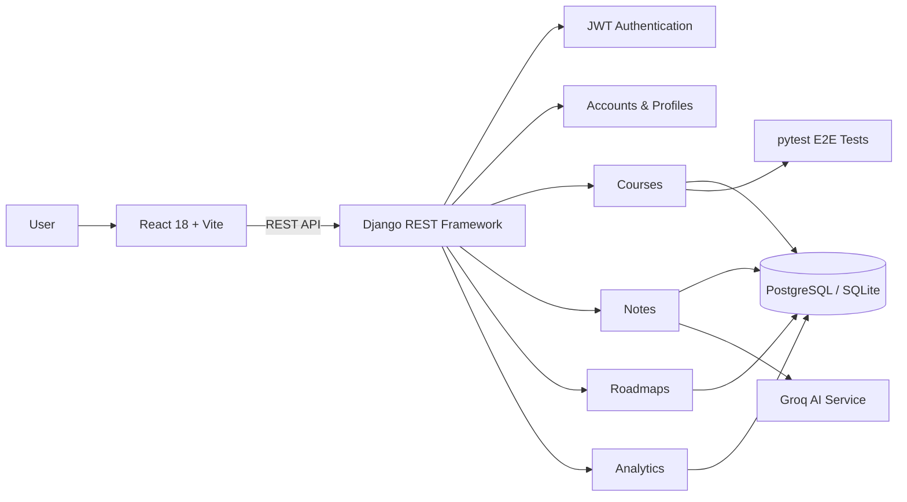

<div align="center">

# SK LearnTrack

### Full-Stack Learning & Course Management Platform

**Django REST Framework · React · PostgreSQL · JWT · Groq AI · pytest**

A full-stack education platform focused on structured course delivery, admin course authoring, student progress tracking, notes, roadmaps, analytics, and AI-assisted learning workflows.

<p>
  
  
  
  
  
  
</p>

</div>

---

## Overview

**SK LearnTrack** is a full-stack learning platform that combines a Django REST Framework backend with a React/Vite frontend.

The repository contains working implementations for authentication, profiles, courses, notes, roadmaps, analytics, admin course management, student enrollment/progress flows, and AI-assisted note/content features.

The project is most useful as engineering evidence for:

- API-driven product development
- Django REST Framework architecture
- JWT authentication and protected workflows
- complex relational course models
- admin vs student permission boundaries
- React-based course-authoring interfaces
- testing of end-to-end course-management flows
- AI integration through Groq
- PostgreSQL-ready deployment configuration

---

## Product Areas

| Area | What the repository implements |
|---|---|
| Authentication | Custom user model, email-based auth, JWT access/refresh tokens |
| Profiles | Profile APIs and user settings |
| Courses | Course, chapter, topic, enrollment, progress, quizzes, notes and bookmarks |
| Admin Course Builder | Create/edit/publish course content and reorder structure |
| Student Learning | Browse courses, enroll, view topics and track progress |
| Notes | Personal notes and AI-assisted learning workflows |
| Roadmaps | Learning-roadmap APIs |
| Analytics | Dashboard and analytics endpoints |
| AI Tools | Groq-backed educational content assistance |

---

## Architecture



### Request flow

```text
React frontend
    ↓
Axios / REST requests
    ↓
Django REST Framework
    ↓
Authentication + permissions
    ↓
Domain views / serializers
    ↓
Django ORM
    ↓
PostgreSQL or SQLite
```

---

## Backend Engineering

The backend is built with:

- **Django 4.2.7**
- **Django REST Framework 3.16.1**
- **Simple JWT 5.5.1**
- **PostgreSQL support via psycopg2 and dj-database-url**
- **SQLite fallback for local development**
- **WhiteNoise** for static-file delivery
- **SendGrid / SMTP configuration**
- **Groq and OpenAI SDK dependencies**
- **pytest** for API and workflow testing

### Backend applications

```text
sklearntrack_backend/
├── accounts/
├── profiles/
├── courses/
├── notes/
├── roadmaps/
├── analytics/
├── tests/
└── sklearntrack_backend/
```

---

## Authentication & Security

Authentication is based on JWT using Simple JWT.

Verified configuration includes:

- email-oriented authentication backend
- 60-minute access tokens
- 7-day refresh tokens
- refresh-token rotation
- refresh-token blacklisting
- Bearer authentication
- authenticated-or-read-only API defaults
- CORS configuration for development and deployed frontend origins
- environment-driven secret configuration

> The repository currently includes a development fallback Django secret in settings. Production deployments should always provide a real `SECRET_KEY` through environment variables.

---

## Course Management

The course domain contains a structured hierarchy:

```text
Course
└── CourseChapter
    └── CourseTopic
        ├── TopicAsset
        ├── Code / content resources
        ├── Quiz
        └── Progress-related data
```

The implementation includes:

- draft / ready / published / archived course states
- SEO-friendly course and topic slugs
- topic ordering
- archived content handling
- course publishing workflows
- course versioning / audit-oriented models
- student enrollment
- topic-level progress
- quizzes
- notes
- bookmarks

---

## Admin Course Builder

The React frontend includes real admin course-management components such as:

- `CourseListPage.jsx`
- `CourseCreatePage.jsx`
- `CourseBuilder.jsx`
- `CourseMetadataPanel.jsx`
- `CourseStructureTree.jsx`

The admin experience supports workflows around:

- listing and searching courses
- creating courses
- editing course metadata
- building chapter/topic structure
- publishing course content
- duplication actions
- drag-and-drop-oriented structure management

The course builder is implemented as a multi-panel React workspace rather than being only described in documentation.

---

## Student Learning Flows

Backend student APIs include:

- published-course discovery
- course detail retrieval
- enrollment
- course progress
- topic access
- quiz submission
- personal notes
- topic bookmarks
- dashboard / resume workflows

A dedicated end-to-end test verifies:

1. an admin creates a course,
2. adds a chapter and topic,
3. publishes the course,
4. a student discovers the course,
5. enrolls,
6. and retrieves progress.

This provides concrete evidence that the core course lifecycle is represented in executable tests.

---

## AI-Assisted Learning

The repository contains a working Groq-backed AI service under:

```text
sklearntrack_backend/notes/ai_service.py
```

That service:

- initializes the Groq client from environment configuration
- supports multiple learner levels
- generates structured educational explanations
- converts generated Markdown into rendered learning content
- handles unavailable configuration gracefully

The repository also contains a course-oriented AI design guide in:

```text
sklearntrack_backend/courses/AI_SERVICE.md
```

The course-generation document should be treated as design/documentation evidence unless the corresponding runtime integration is present in code.

---

## Frontend Stack

The frontend uses:

- **React 18**
- **Vite 5**
- **Redux Toolkit**
- **React Router**
- **Axios**
- **Tailwind CSS**
- **Framer Motion**
- **dnd-kit**
- **Monaco Editor**
- **React Markdown**
- **React Quill**
- **Recharts**
- **React Hot Toast**

This gives the project evidence beyond backend development: state management, routing, data fetching, authoring UI, charts, drag-and-drop and rich content editing are all represented in the frontend stack.

---

## Testing

The backend contains pytest-based API tests covering multiple domains.

Examples include:

- authentication
- courses
- notes
- roadmaps
- analytics
- code snippets
- course-management end-to-end behavior
- Groq configuration checks

Run tests with:

```bash
cd sklearntrack_backend
pytest
```

Or run the course-management workflow specifically:

```bash
pytest tests/test_course_management_e2e.py
```

This README intentionally does not publish a coverage percentage because no current verified coverage report was inspected during this documentation pass.

---

## Local Development

### Prerequisites

- Python 3.11+
- Node.js 18+
- npm
- PostgreSQL optional for local production-like testing

### 1. Clone

```bash
git clone https://github.com/Shahriyar-Kh/SK_LearnTrack.git
cd SK_LearnTrack
```

### 2. Backend

```bash
cd sklearntrack_backend
python -m venv .venv
```

Windows:

```bash
.venv\Scripts\activate
```

macOS / Linux:

```bash
source .venv/bin/activate
```

Install dependencies:

```bash
pip install -r requirements.txt
```

Configure environment variables, then run:

```bash
python manage.py migrate
python manage.py runserver
```

### 3. Frontend

From another terminal:

```bash
cd sklearntrack-frontend
npm install
npm run dev
```

---

## Important Environment Variables

Typical runtime configuration includes:

```env
SECRET_KEY=replace-with-a-secure-secret
DEBUG=True
DATABASE_URL=postgresql://...
GROQ_API_KEY=...
OPENAI_API_KEY=...
FRONTEND_URL=http://localhost:3000
CORS_ALLOWED_ORIGINS=http://localhost:3000
```

Do not commit production keys, passwords, database credentials or real `.env` files.

---

## Deployment Configuration

The codebase contains configuration for:

- PostgreSQL through `DATABASE_URL`
- Render-style host configuration
- Vercel frontend origins
- WhiteNoise static-file handling
- SendGrid or standard SMTP email delivery

A Vercel frontend URL and Render backend host are referenced in configuration, but this README does not label them as currently live until deployment availability is re-verified.

---

## Celery / Background Processing

Celery and Redis-related packages are present in the dependency set, and `django-celery-beat` is installed.

However, the current Celery broker/result configuration in `settings.py` is commented out.

For that reason, this README treats Celery as **available/scaffolded infrastructure**, not as a verified active production worker setup.

---

## Repository Structure

```text
SK_LearnTrack/
├── README.md
├── ARCHITECTURE.md
├── QUICK_START.md
├── COMPLETE_SYSTEM_GUIDE.md
├── IMPLEMENTATION_CHECKLIST.md
│
├── sklearntrack_backend/
│   ├── accounts/
│   ├── profiles/
│   ├── courses/
│   ├── notes/
│   ├── roadmaps/
│   ├── analytics/
│   ├── tests/
│   ├── manage.py
│   └── requirements.txt
│
└── sklearntrack-frontend/
    ├── src/
    │   ├── components/
    │   ├── services/
    │   ├── store/
    │   └── ...
    ├── package.json
    └── vite.config.js
```

---

## Documentation

Additional project documents include:

- [Architecture](ARCHITECTURE.md)
- [Quick Start](QUICK_START.md)
- [Complete System Guide](COMPLETE_SYSTEM_GUIDE.md)
- [React Components](REACT_COMPONENTS.md)
- [Implementation Checklist](IMPLEMENTATION_CHECKLIST.md)
- [Course AI Service Design](sklearntrack_backend/courses/AI_SERVICE.md)

Some older documentation contains aspirational scale, cost, and production-readiness language. Those documents should be interpreted as historical design/planning material unless supported by current runtime evidence.

---

## Engineering Evidence for Reviewers

If you are reviewing this repository for a software-engineering role, useful entry points are:

- `sklearntrack_backend/courses/models.py`
- `sklearntrack_backend/courses/views_admin.py`
- `sklearntrack_backend/courses/views_student.py`
- `sklearntrack_backend/tests/test_course_management_e2e.py`
- `sklearntrack_backend/notes/ai_service.py`
- `sklearntrack_backend/sklearntrack_backend/settings.py`
- `sklearntrack-frontend/src/components/admin/CourseBuilder.jsx`
- `sklearntrack-frontend/src/components/admin/CourseListPage.jsx`
- `sklearntrack-frontend/package.json`

These files show the implementation more clearly than marketing claims or feature-count summaries.

---

## Project Status

SK LearnTrack is an active portfolio and learning-platform project with implemented backend and frontend functionality.

This README intentionally avoids unsupported claims such as:

- “millions of users”
- “world-class”
- guaranteed production scale
- fixed infrastructure cost projections
- unverified performance numbers

The goal is to present what the repository actually demonstrates.

---

## Author

**Shahriyar Khan**  
Software Engineer · Full-Stack Python Developer

**Core stack:** Python · Django · Django REST Framework · FastAPI · React · PostgreSQL

- GitHub: [@Shahriyar-Kh](https://github.com/Shahriyar-Kh)
- Portfolio: [shahriyarkhan.com](https://shahriyarkhan.com)
- LinkedIn: [Shahriyar Khan](https://www.linkedin.com/in/shahriyar-kh/)

---

<div align="center">

**Backend architecture · REST APIs · authentication · course-management workflows · React integration · AI-assisted learning**

</div>
